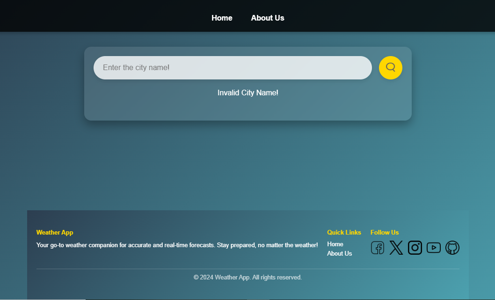
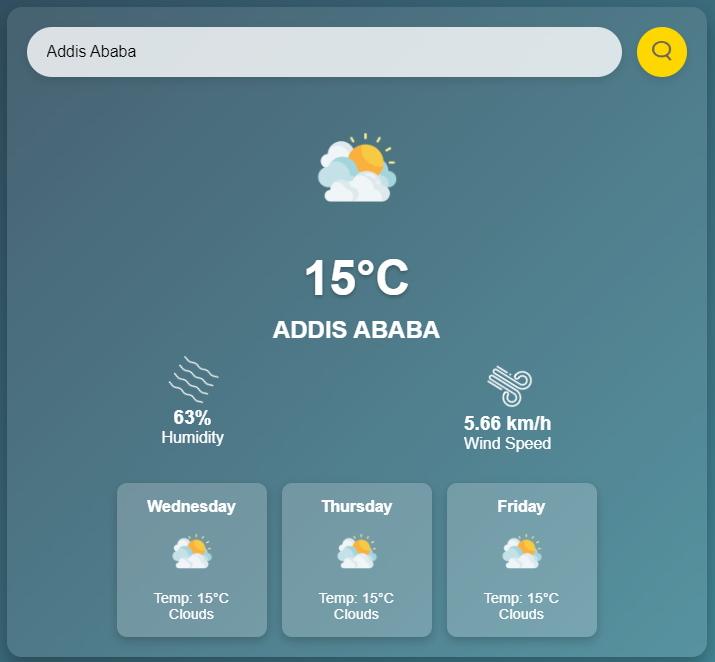
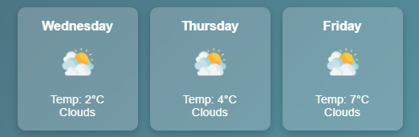
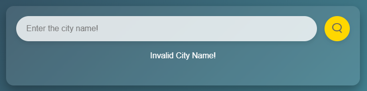

# Simple Weather App 🌦️

This is a simple weather forecasting application built using **HTML**, **CSS**, and **JavaScript**. It fetches real-time weather data using the [OpenWeather API](https://openweathermap.org/api). 

## Features
- **Current Weather Forecast**: Get the latest weather details of a city.

- **Next 3 Days Forecast**: Displays weather predictions for the next three days.

- **Search Functionality**: Enter a city name to view its weather information.

## How It Works
1. Enter the name of a city in the input field.
2. Press "search icon".
3. The app fetches the current weather and a three-day forecast using the OpenWeather API and displays it on the page.

## Technologies Used
- **HTML**: Structure of the app.
- **CSS**: Styling and layout.
- **JavaScript**: Functionality and API calls.
- **OpenWeather API**: To fetch weather data.

